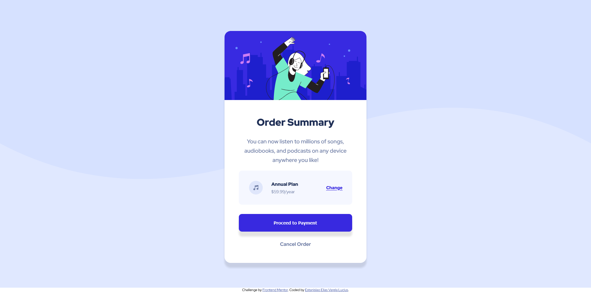

# Frontend Mentor - Order summary card solution

This is a solution to the [Order summary card challenge on Frontend Mentor](https://www.frontendmentor.io/challenges/order-summary-component-QlPmajDUj).
## Table of contents

- [Overview](#overview)
  - [The challenge](#the-challenge)
  - [Screenshot](#screenshot)
  - [Links](#links)
- [My process](#my-process)
  - [Built with](#built-with)
  - [What I learned](#what-i-learned)
  - [Useful resources](#useful-resources)
- [Author](#author)

## Overview

### The challenge

Users should be able to:

- See hover states for interactive elements

### Screenshot

Desktop:

Mobile:

### Links

- Solution URL: [link](https://github.com/EstanisEVL/order-summary-component)
- Live Site URL: [link](https://estanisevl.github.io/order-summary-component/)

## My process

### Built with

- HTML5
- CSS custom properties
- Flexbox
- SASS/SCSS
- Mobile-first workflow
- GIT

### What I learned

In this project I learned to implement different hover states in different elements. I also used the challenge to improve the way I replicate element sizes and colors in order to get the final project to look as close to the design as possible.

### Useful resources

- [CSS Box Shadow Generator](https://cssgenerator.org/box-shadow-css-generator.html) - This helped me create the shadows for this project. I really liked this resource and will use it going forward.

## Author

- Github - [Estanislao Elias Varela Lucius](https://github.com/EstanisEVL)
- Frontend Mentor - [@EstanisEVL](https://www.frontendmentor.io/profile/EstanisEVL)
